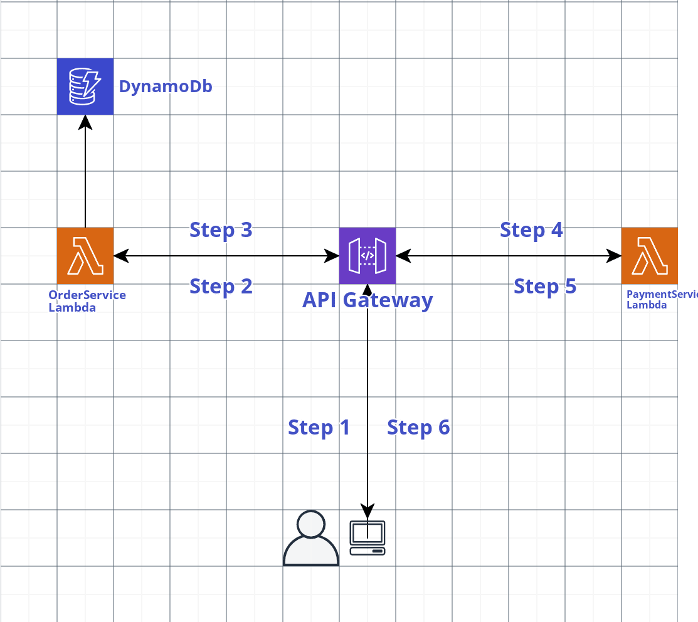

## Introduction

This project is for this assesment: 2018.02.27-fullstack-engineer-practical in GoogleSlide.

This project contain 2 parts. Frontend and CDK, both inside the relevant folder in the repo, here is all the stack I used.

- **Frontend:** Nextjs
- **Backend:** Nestjs with aws Lambda
- **Database:** DynamoDB
- **Backend Deploy:** CDK
- **Frontend Deploy:**: Vercel
- **Aws service I used**: DynamoDB, Lambda, Api Gateway

## TLDR

In order to save your time, I have hosted this project, so you can take a look.

**Website:** Go to the website I provide (Dont want to state here to avoid abuse.)

## How it works?

In frontend pretty much self-explanatory. Which includes all this pages:

- `/` : Demonstrate product to make order
- `/order`: Display all the order you display before
- `/order/create` : create the order
- `/order/:orderId`: check status of 1 specific order, and `cancel` an order with a button
- `/payment`: make payment do all 6 step below for backend

For backend, below is how I design the flow for the requirement mention at Thrid slide(General Scenario)



- **Step 1:**: User call to API gateway, `POST /orders` to create an order
- **Step 2:**: APIgateway trigger to OrderServiceLambda
- **Step 3:**: OrderServiceLambda done created order and store in Db, called to `POST /payment` method
- **Step 4:**: APIgateway trigger PaymentServiceLambda to process payment
- **Step 5:**: PaymentServiceLambda will do the following:
  1. produce the "payment status" to either Confirmed or Declined.
  2. I use RXjs to loop through and array with status like `[Initializing, Processing, Confirmed/Declined]`
  3. Every 3 second will call `PUT /orders/orderId` to update the value from the array to update the Payment status in `OrderService`
  4. You can see the code here:
- **Step 6:**: In client, user will long polling using RXjs,

  1.  every 5 seconds will client will call to `GET /orders/status/:userId/:orderId`
  2.  this will return the payment status wheter is `Initializing, Processing, Confirmed/Declined`
  3.  Depends on each `status`, the client will response accordingly
  4.  Until if `status` is confirmed, then will wait for 3 seconds, then tell user is `Delivered`, and update in DB as well.

## Step by step guide how to deploy this project

- #### Deploy to aws using CDK

  Prerequisite: CDK CLI, have your aws account configured in your system

  cd to `cdk` folder to do all this below. A bit work to do, cause I havent do the CI stuff

  1. Install all the stuff, and build for deployment, below all start from `/` root folder

  ```
   // in root, for CDK stuff
   yarn

   // For Lambda Layer
   $ cd lambda/layer/nodejs
   $ yarn
   $ yarn build

   // For OrderService
   $ cd lambda/order
   $ yarn
   $ yarn build

   // For PaymentService
   $ cd lambda/payment
   $ yarn
   $ yarn build
  ```

2. Insert the AWS account you want to deploy to [here](https://github.com/kenchoong/Setel-assessment/blob/1a1aab238684d14c6acd04271a5e3a47c01b070c/cdk/bin/cdk.ts#L9), have to same account with the account you `aws configure` early on. In case you dont want to specific an account, just make the whole file like this (remove the `demoStack` from `CdkStack`):

   ```
   code bin/cdk.ts


   port "source-map-support/register";
   import * as cdk from "@aws-cdk/core";
   import { CdkStack } from "../lib/cdk-stack";

   const app = new cdk.App();

   new CdkStack(app, "CdkStack");
   ```

3. Get the CloudFormation (Part of assessment)

   ```
    $ cdk synth
    // the cloudformation will be in cdk.out folder
   ```

4. Deploy to cloud

   ```
   // if didnt have account specified(as mention in step 2)
   $ cdk deploy

   // if have account specific, then use a profile from that account.
   $ cdk deploy --profile MyIAMprofileHere
   ```

Done. After a while, all the stack will be deployed, and output an URL. Then we move to Fronted end.

- #### Deploy Frontend

  1. Copy the URL after the `cdk deploy` and

  ```
  cd frontend
  code -r .env.production

  // paste the URL from Backend step 3 to make file become like this
  NEXT_PUBLIC_API_URL="YOUR_API_URL_HERE"
  ```

  Done. Thats all you need to setup for frontend. Then deploy it to Vercel by connect with github, settle in 2 mins.

## Some random thought

At the end, I just realize that Step Function is the best solution for this assessment, cause Lambda is very hard to control the time at the background, certainly once hit, get response imediately. I didnt thought this at the beginning. If given me few more days, I will definitely try using Step Function. My mistake, but never mind, by now, it is what it is. By the way, let me know if able to give me few more days. 😂🤣

### Thats it. Thanks for reading. If anything, just let me know in issue, I want to learn from you.
